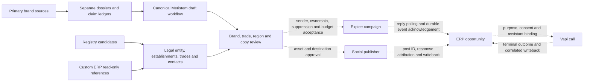

# Axtech portfolio preparation — current evidence and connected flow

Observed 5 October 2026. This is the review map for the active portfolio task, governed by [ISA](../ISA.md). Operator communication is English; prospect-facing drafts use French `fr-FR` and `vous`.

## Commercial routing

| Brand | Evidenced offer | Relevant current lane | Boundary |
| --- | --- | --- | --- |
| Axtech | Portfolio of the supplied operating brands | Route a qualified need to the matching brand | Legal sender and campaign ownership are separate from the portfolio label |
| HeyZack | Building automation, equipment/energy/access control | Installers and relevant architecture/fluid engineering needs | Do not claim stock, compatibility, energy savings or a complete live service without specific proof |
| Ecoled Europe | Professional LED lighting, photometric/optical project work declared by the site | Electrical installation, relevant lighting prescription/architecture and BET | Pure plumbing/CVC/structural segments need a lighting requirement; no automatic CEE, origin or delivery claim |
| Kartezzi | Furniture/joinery, kitchens, doors, decorative materials and integrated lighting | Architecture/interior project prescription | Do not invent plumbing/CVC or engineering offers to fill MEP categories |
| Wave Concept | Mobile accessories, energy/audio/support assortments, reconditioned/display entries | Separate possible reseller/distributor lane | Excluded from current MEP campaigns; marketplace stock/prices/returns/connectors remain unverified |
| Symphonics | No established first-party offer | Identity review hold | Exact supplied host fails DNS; Firecrawl returns empty content; similarly named domains are excluded |

Each brand has a separate [dossier and evidence record](../brands/axtech-portfolio-20261002/). Website assertions remain first-party declarations; proposed personas, values and positioning remain internal strategy. The [marketing KB](../brands/axtech-portfolio-20261002/marketing-kb/README.md) routes the relevant source bundle and contains internally curated examples.

## Trade and regional records

The nine exclusive primary segments are electricity, plumbing, HVAC, verified plumbing+HVAC, other combined MEP, architecture, fluid engineering, structural engineering and combined engineering. Independent activity evidence remains attached. One organization enters one primary segment after its evidenced activities are merged; unknown installer/prescriber overlap stays in review. All sizes, zero-employee records and sole traders are retained.

SIREN identifies the legal organization; SIRET identifies an establishment. The current regional repair must retain multiple establishments, geography and source pointers without duplicating outreach. Headquarters and matching-establishment locations describe the prospect; neither demonstrates Axtech service coverage. A region-specific message uses a verified prospect location and a relevant need, with no unsupported local-team or nationwide-installation promise.

The actual 5 October public-registry sample has five company records, preserved headquarters department/region and zero import leads after discover→classify→export. These are NAF-only research candidates, not a complete contact database. The official [Recherche d'entreprises documentation](https://recherche-entreprises.api.gouv.fr/docs/) limits accessible data and says it does not expose the complete Sirene database. It documents separate matching-establishment pagination and a maximum of 25 legal-entity results per page. The sample's reported total of 10,000 does not prove collection of all companies in France. A future coverage run needs a dated source/partition/coverage manifest, establishment pagination, legal-entity deduplication and independent trade/contact qualification.

## Actual current connections

| Surface | Evidence | Current state |
| --- | --- | --- |
| Research | 2 October explicit Exa/Firecrawl receipts and six dossiers; 5 October Perplexity/Symphonics rechecks | Exa/Firecrawl supplied usable evidence for five brands. Perplexity returned semantic sign-up text despite HTTP200 and remains excluded |
| Meristem | Canonical shell runner, private attempts and output/HTTP/validation receipts | Earlier attempts remain failed/partial. Four v4 runs completed research/strategy, then stopped at the128KiB content guard; Kartezzi stopped at cited competitor URL validation. Repaired v5 content continuations and a fresh Kartezzi run are underway; editorial acceptance pending |
| Campaign CLI | 107 local tests, strict typecheck, independent 12-probe final audit, actual registry sample | Classification/dedup/export and held brand-plan gates verified locally; establishment preservation repair pending |
| Custom ERP MCP | 2 October scoped schema/reference/aggregate audit; 5 October connection and business-unit/brand reference revalidation | Reference connection works, read-only. Writes, suppression/consent, ownership, idempotency and event acknowledgement remain unaccepted |
| Explee | Actual 5 October authenticated GET snapshot | One project: HeyZack `43522`, daily budget USD0, no current campaigns, zero sends/replies/hot leads/spend. Autopilot and auto-reply settings are enabled. No setting was changed |
| Vapi | Current and historical source audit | Callback/brochure success stubs and incomplete terminal writeback are recorded; no live call test or current binding accepted |
| Social | Source-linked draft requirements | Destination accounts, publisher adapter and ERP attribution unbound; no publication |

Explee source receipt: `/Volumes/madara/2026/Projects/thoughtseed/heyzack/axtech-campaign-agent/receipts/explee-20261005.json` and its provenance sidecar. The 2 October archive receipt remains unchanged; six former campaign IDs are tombstones, not reusable drafts. Six 5 October brand plans are offline definitions, all operationally held. Only HeyZack matches an actual project; the remaining projects are unbound.

## Target connected flow and acceptance

Dashed paths are target contracts. The diagram is not evidence that these adapters are installed. Exact write-field/returned-ID mappings, tenant/environment and durable suppression/consent remain unknown. Current ERP business-unit candidates are distinct from the separate test-only brand table; taxonomy names do not authorize a write or campaign sender.

The portable [ERP contract](../../heyzack/axtech-campaign-agent/docs/CUSTOM-ERP-MCP-CONTRACT.md) defines ten acceptance vectors and evidence classes. Before live acceptance, require actual organization/contact/campaign/event mappings; stable namespaced idempotency; suppression failure holds; Explee overlapping inbox pagination with durable acknowledgement; Vapi dispatch plus terminal report and ERP writeback; and publisher post IDs plus response attribution. A fixture, source handler, queue success or locally generated JSON cannot satisfy live acceptance.

The reviewed Explee public API has inbox reads and no documented webhook endpoint. Import creates a campaign and may automatically send; it is not draft creation. Missing real first/last name, role, company domain or contact provenance remains ineligible. Current preparation never imports, sends, starts, raises budget, writes ERP, dials or publishes.

## Remaining execution

1. Strategy order, draft/launch separation and verified continuation source repairs pass60Python checks and6shell suites; preserve these gates and the earlier failures.
2. Finish actual v5 wave6 continuations from four verified wave1/2 checkpoints and the fresh scoped Kartezzi run. Imported upstreams do not become target wave completions. Preserve Symphonics' explicit identity hold.
3. Inspect substantive strategy/email/social output, evidence references, French locale, relevant trade fit and regional wording; curate reviewed drafts with hashes/provenance rather than committing raw prompt traces.
4. Finish establishment-preservation acceptance, then repeat the meaningful local record/plan/export path.
5. Resolve actual external contracts and receive the corresponding operational evidence before campaign activation or publication. Current read-only authority remains unchanged.

Editorial review: [AXTECH-EDITORIAL-REVIEW-20261005.md](AXTECH-EDITORIAL-REVIEW-20261005.md) inspected34completed upstream drafts. Required corrections keep internal audit/ERP caveats outside prospect copy, remove unsupported competitor claims, preserve existing identity, label personas illustrative and separate registered source IDs from hashed upstream references. Current generation is not owner acceptance.
