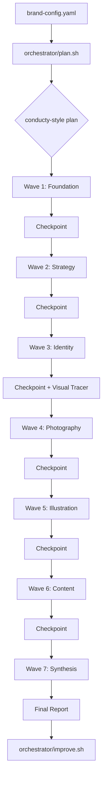

# Brandmint v2 - Agent-Native Brand Pipeline

## Executive Summary

Brandmint v2 is a complete reimagining of the brand generation pipeline, designed from the ground up for **agent-first execution**. It strips away all UI layers (Tauri, React, Rich TUI) and instead leverages:

1. **Skill Clusters** (from `~/.agents/skill-clusters`) - Hub-and-spoke architecture per wave
2. **spec-kit** (github/spec-kit) - Spec-driven development for each cluster
3. **conducty** (robertbarclayy/conducty) - Orchestration layer with Obsidian vault as context engine
4. **Shell-first execution** - Deterministic `.sh` scripts over Python for reliability

---

## Architecture Overview

```
brandmint-v2/
├── AGENTS.md                           # Agent routing instructions
├── REVIEW.md                           # This document
├── constitution.md                     # Project principles (spec-kit)
│
├── orchestrator/                       # Conducty-integrated orchestration
│   ├── vault/                          # Obsidian vault (context engine)
│   │   ├── Brandmint Index.md          # Root hub
│   │   ├── Plans/                      # Plan YYYY-MM-DD HHmm.md
│   │   ├── Context/                    # Per-brand context graphs
│   │   ├── Improvements/               # Learning loop notes
│   │   └── Accumulators/
│   │       ├── Failure Patterns.md
│   │       ├── Metrics.md
│   │       └── Prompt Log.md
│   │
│   ├── plan.sh                         # conducty-plan equivalent
│   ├── execute.sh                      # conducty-execute (tracer-first)
│   ├── checkpoint.sh                   # Between-wave health metrics
│   └── improve.sh                      # Learning loop extraction
│
├── clusters/                           # Hub-and-spoke skill clusters
│   ├── foundation/                     # Wave 1
│   │   ├── README.md
│   │   ├── brandmint-foundation-orchestrator.md
│   │   ├── brandmint-foundation-core.md
│   │   └── spokes/
│   │       ├── brand-foundation.md
│   │       ├── buyer-persona.md
│   │       ├── competitor-analysis.md
│   │       └── value-proposition.md
│   │
│   ├── strategy/                       # Wave 2
│   │   ├── README.md
│   │   ├── brandmint-strategy-orchestrator.md
│   │   ├── brandmint-strategy-core.md
│   │   └── spokes/
│   │       ├── voice-and-tone.md       # Extracted from brand-genesis
│   │       ├── product-positioning.md   # Extracted from brand-genesis
│   │       ├── messaging-framework.md
│   │       └── brand-story.md
│   │
│   ├── identity/                       # Wave 3
│   │   ├── README.md
│   │   ├── brandmint-identity-orchestrator.md
│   │   ├── brandmint-identity-core.md
│   │   └── spokes/
│   │       ├── logo-concept.md
│   │       ├── color-palette.md
│   │       ├── typography.md
│   │       └── visual-language.md
│   │
│   ├── photography/                    # Wave 4
│   │   ├── README.md
│   │   ├── brandmint-photography-orchestrator.md
│   │   ├── brandmint-photography-core.md
│   │   └── spokes/
│   │       ├── lifestyle-photography.md
│   │       ├── product-photography.md
│   │       └── hero-shots.md
│   │
│   ├── illustration/                   # Wave 5
│   │   ├── README.md
│   │   ├── brandmint-illustration-orchestrator.md
│   │   ├── brandmint-illustration-core.md
│   │   └── spokes/
│   │       ├── brand-illustrations.md
│   │       ├── icon-system.md
│   │       └── pattern-library.md
│   │
│   ├── content/                        # Wave 6
│   │   ├── README.md
│   │   ├── brandmint-content-orchestrator.md
│   │   ├── brandmint-content-core.md
│   │   └── spokes/
│   │       ├── landing-page-copy.md    # Extracted from brand-genesis
│   │       ├── email-sequences.md      # Extracted from brand-genesis
│   │       ├── ad-creative.md          # Extracted from brand-genesis
│   │       └── press-release.md        # Extracted from brand-genesis
│   │
│   └── synthesis/                      # Wave 7
│       ├── README.md
│       ├── brandmint-synthesis-orchestrator.md
│       ├── brandmint-synthesis-core.md
│       └── spokes/
│           ├── notebooklm-publisher.md
│           ├── brand-docs.md
│           └── wiki-generator.md
│
├── visual/                             # Visual pipeline (simplified)
│   ├── gpt-image-2/                    # Copied from skills-archive
│   │   ├── SKILL.md
│   │   └── scripts/
│   │       ├── gen.sh
│   │       └── extract_image.py
│   │
│   └── arcplume/                       # Video generation (via Grok)
│       ├── SKILL.md
│       └── scripts/
│           └── gen-video.sh
│
├── specs/                              # spec-kit compatible
│   ├── constitution.md                 # Project principles
│   └── features/
│       ├── 001-foundation-cluster/
│       │   ├── spec.md
│       │   ├── plan.md
│       │   └── tasks.md
│       └── ...per-cluster specs
│
├── runner/                             # Shell-first execution
│   ├── bm.sh                           # Main entry point
│   ├── launch.sh                       # Pipeline launcher
│   ├── status.sh                       # Status checker
│   ├── resume.sh                       # Resume from checkpoint
│   └── lib/
│       ├── common.sh                   # Shared functions
│       ├── vault.sh                    # Obsidian vault operations
│       ├── cluster.sh                  # Cluster routing
│       └── visual.sh                   # Image/video dispatch
│
└── .brandmint/                         # Runtime state (per-brand)
    ├── prompts/                        # Generated prompts
    ├── outputs/                        # Skill outputs (JSON)
    ├── state.json                      # Pipeline state
    └── vault/                          # Brand-specific vault notes
```

---

## Key Decisions

### 1. Shell-First Execution (`.sh` over `.py`)

**Rationale:** Python's async, import chains, and dependency management have caused non-deterministic failures. Shell scripts are:
- Atomic (one file = one operation)
- Inspectable (no hidden state)
- Composable (pipes, subshells)
- Deterministic (same input = same output)

**Pattern:**
```bash
#!/usr/bin/env bash
set -euo pipefail  # Fail fast, no unset vars, pipefail

# Source common functions
source "$(dirname "$0")/lib/common.sh"

# Main logic
main() {
    local brand_config="$1"
    local wave="$2"
    
    # Validate inputs
    require_file "$brand_config"
    require_in_range "$wave" 1 7
    
    # Execute
    execute_wave "$brand_config" "$wave"
}

main "$@"
```

### 2. Skill Cluster Architecture

Each wave becomes a **hub-and-spoke cluster** following the `skill-clusters` pattern:

**Orchestrator** (`*-orchestrator.md`):
- Routes fuzzy intent to correct spoke
- Lists all spokes in cluster
- Handles composition (multiple spokes per task)

**Core** (`*-core.md`):
- Decision rules (when to use which spoke)
- Output format conventions
- Quality gates and guardrails
- Dependency rules (what upstream data is required)

**Spokes** (`spokes/*.md`):
- Individual skill implementations
- Load on-demand (not enumerated at startup)
- Reference core for shared rules

### 3. Visual Pipeline (Simplified)

| Asset Type | Provider | Skill |
|------------|----------|-------|
| Images | GPT Image 2 (via ChatGPT subscription) | `visual/gpt-image-2/` |
| Videos | Arcplume (via Grok/X session) | `visual/arcplume/` |

**No other providers.** Single path = deterministic behavior.

### 4. Conducty Integration

The orchestrator layer adopts conducty's cycle:

```
Shape → Plan → Trace → Execute → Checkpoint → Improve
```

**Obsidian Vault as Context Engine:**
- Plans link to designs, context, prior plans
- Failure patterns accumulate and inform future runs
- Metrics track pass rates, timing, costs
- Improvements capture learnings per run

### 5. spec-kit for Cluster Development

Each cluster is developed using spec-driven flow:

```bash
# Initialize cluster spec
specify init clusters/foundation --integration codex --integration-options="--skills"

# Develop via slash commands
/speckit.constitution   # Cluster principles
/speckit.specify        # What this cluster produces
/speckit.plan           # Implementation approach
/speckit.tasks          # Actionable breakdown
/speckit.implement      # Build it
```

---

## Brand-Genesis Extraction Map

Templates from `/brand-genesis/templates/` → Skill spokes:

| Template | Target Cluster | Spoke |
|----------|----------------|-------|
| `buyerpersona.md` | foundation | `buyer-persona.md` |
| `competitor-summary.md` | foundation | `competitor-analysis.md` |
| `Product-positioning-summary.md` | strategy | `product-positioning.md` |
| `voice-and-tone.md` | strategy | `voice-and-tone.md` |
| `landingpage-copy.md` | content | `landing-page-copy.md` |
| `campaign-page-copy.md` | content | `campaign-copy.md` |
| `welcome-email-sequence.md` | content | `email-sequences.md` |
| `prelaunch-email-campaign-sequence.md` | content | `email-sequences.md` |
| `launch-campaign-email-sequence.md` | content | `email-sequences.md` |
| `precampaign-ads-copy.md` | content | `ad-creative.md` |
| `livecampaigns-ads-copy.md` | content | `ad-creative.md` |
| `pressrelease-copy.md` | content | `press-release.md` |
| `product-description.md` | content | `product-copy.md` |
| `campaign-videoscript.md` | content | `video-scripts.md` |

**Key extraction pattern:** Each template follows a multi-prompt conversation structure. Convert to:
1. SKILL.md with frontmatter + routing triggers
2. Embedded prompts as numbered steps
3. Output schema (JSON) for downstream consumption

---

## Wave Execution Flow



### Per-Wave Execution (Shell)

```bash
# runner/lib/cluster.sh

execute_cluster() {
    local cluster="$1"
    local brand_config="$2"
    local brand_dir="$3"
    
    local cluster_dir="clusters/$cluster"
    local orchestrator="$cluster_dir/brandmint-${cluster}-orchestrator.md"
    
    # 1. Load orchestrator to get spoke list
    local spokes=$(parse_spoke_list "$orchestrator")
    
    # 2. Run tracer (first spoke) to validate assumptions
    local tracer=$(echo "$spokes" | head -1)
    run_spoke "$tracer" "$brand_config" "$brand_dir" || {
        log_error "Tracer failed for $cluster"
        return 1
    }
    
    # 3. Execute remaining spokes (can parallelize if independent)
    echo "$spokes" | tail -n +2 | while read spoke; do
        run_spoke "$spoke" "$brand_config" "$brand_dir"
    done
    
    # 4. Write checkpoint
    write_checkpoint "$cluster" "$brand_dir"
}

run_spoke() {
    local spoke="$1"
    local brand_config="$2"
    local brand_dir="$3"
    
    local prompt_file="$brand_dir/.brandmint/prompts/${spoke}.md"
    local output_file="$brand_dir/.brandmint/outputs/${spoke}.json"
    
    # Generate prompt from spoke SKILL.md + brand context
    generate_prompt "$spoke" "$brand_config" > "$prompt_file"
    
    # Wait for agent to execute and write output
    wait_for_output "$output_file" 300  # 5 min timeout
    
    # Validate output schema
    validate_output "$spoke" "$output_file"
}
```

---

## Visual Pipeline (Shell-First)

### Image Generation (GPT Image 2)

```bash
# visual/gpt-image-2/scripts/gen.sh
# Already exists in skills-archive, copy as-is

# Usage from cluster spoke:
bash visual/gpt-image-2/scripts/gen.sh \
    --prompt "$(cat prompts/logo-concept.txt)" \
    --out "$brand_dir/generated/logo-v1.png"
```

### Video Generation (Arcplume via Grok)

```bash
# visual/arcplume/scripts/gen-video.sh

#!/usr/bin/env bash
set -euo pipefail

# Requires: bird CLI, AUTH_TOKEN, CT0

main() {
    local prompt="$1"
    local output="$2"
    local duration="${3:-30}"  # seconds
    
    # Validate credentials
    require_env AUTH_TOKEN CT0
    bird --auth-token "$AUTH_TOKEN" --ct0 "$CT0" whoami || {
        die "Grok session invalid. Refresh AUTH_TOKEN/CT0."
    }
    
    # Generate via Grok
    bird --auth-token "$AUTH_TOKEN" --ct0 "$CT0" \
        grok video \
        --prompt "$prompt" \
        --duration "$duration" \
        --output "$output"
}

main "$@"
```

---

## CLI Interface (Agent-Friendly)

```bash
# runner/bm.sh

#!/usr/bin/env bash
set -euo pipefail

SCRIPT_DIR="$(cd "$(dirname "$0")" && pwd)"
source "$SCRIPT_DIR/lib/common.sh"

usage() {
    cat <<EOF
brandmint v2 - Agent-Native Brand Pipeline

Usage: bm <command> [options]

Commands:
    launch      Run pipeline (all waves or subset)
    status      Check pipeline state
    resume      Resume from last checkpoint
    plan        Generate execution plan (conducty-style)
    improve     Extract learnings from last run

Options:
    --config <path>         Brand config YAML (required)
    --waves <range>         Wave range (e.g., 1-3, default: 1-7)
    --non-interactive       No prompts, fail on missing data
    --dry-run               Show plan without executing

Examples:
    bm launch --config /path/to/brand-config.yaml --waves 1-3
    bm status --config /path/to/brand-config.yaml
    bm resume --config /path/to/brand-config.yaml

EOF
}

main() {
    [[ $# -lt 1 ]] && { usage; exit 1; }
    
    local cmd="$1"
    shift
    
    case "$cmd" in
        launch)  exec "$SCRIPT_DIR/launch.sh" "$@" ;;
        status)  exec "$SCRIPT_DIR/status.sh" "$@" ;;
        resume)  exec "$SCRIPT_DIR/resume.sh" "$@" ;;
        plan)    exec "$SCRIPT_DIR/../orchestrator/plan.sh" "$@" ;;
        improve) exec "$SCRIPT_DIR/../orchestrator/improve.sh" "$@" ;;
        -h|--help) usage; exit 0 ;;
        *) die "Unknown command: $cmd" ;;
    esac
}

main "$@"
```

---

## Next Steps

1. **Create directory structure** (this review provides the blueprint)
2. **Extract brand-genesis templates** → skill spokes (17 templates → ~10 unique spokes)
3. **Copy gpt-image-2** from skills-archive, test locally
4. **Create arcplume video wrapper** using bird CLI
5. **Build shell runner** (bm.sh + launch.sh + lib/)
6. **Set up conducty vault** structure
7. **Create spec-kit specs** for each cluster
8. **Write AGENTS.md** with cluster routing

---

## Dependencies

| Component | Source | Status |
|-----------|--------|--------|
| skill-clusters pattern | `~/.agents/skill-clusters` | Reference only |
| spec-kit | `github/spec-kit` | Install via `uv tool install` |
| conducty | `robertbarclayy/conducty` | Adapt patterns (not fork) |
| gpt-image-2 | `~/.agents/skills-archive/gpt-image-2` | Copy to visual/ |
| arcplume | `~/.craft-agent/.../skills/arcplume` | Adapt for video |
| brand-genesis templates | `/brand-genesis/templates/` | Extract to spokes |

---

## Glossary

| Term | Definition |
|------|------------|
| **Cluster** | Hub-and-spoke skill group for one wave |
| **Orchestrator** | Hub skill that routes intent to spokes |
| **Core** | Shared reference with decision rules |
| **Spoke** | Individual skill implementation |
| **Tracer** | First prompt in a group that validates assumptions |
| **Checkpoint** | Between-wave health metrics |
| **Vault** | Obsidian-based context engine (conducty pattern) |
